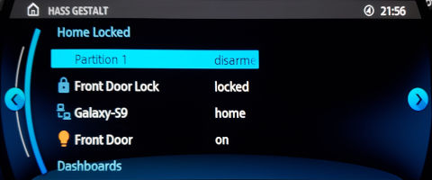

HASS Gestalt
============

Years ago, there used to be an official Samsung Smartthings app for BMW/Mini NBT IDrive 4-6.
Though that app has since died, this project, in combination with [BimmerGestalt AAIdrive](https://github.com/BimmerGestalt/AAIdrive), reimplements the same convenient control over Home Assistant.
Check on your house while you are out and about: View sensor status and remotely toggle smartlocks or lights, all while sitting in traffic!

Server Access
-------------

This project needs to connect to your Home Assistant instance somehow, either through Nabu Casa's [Remote UI](https://www.nabucasa.com/config/remote/),
direct port forwarding, or through a VPN. With some custom authentication gateway setups, the important things are:

  - The `/auth/authorize` page must be accessible from a web browser on your phone, which means it is able to support extra authentication challenges such as 2FA or Social Auth.
  - The `/auth/token` OAuth Endpoint must be accessible directly
  - The `/api/websocket` API must be accessible directly  (The Login button in the phone interface appears after verifying this API is reachable)